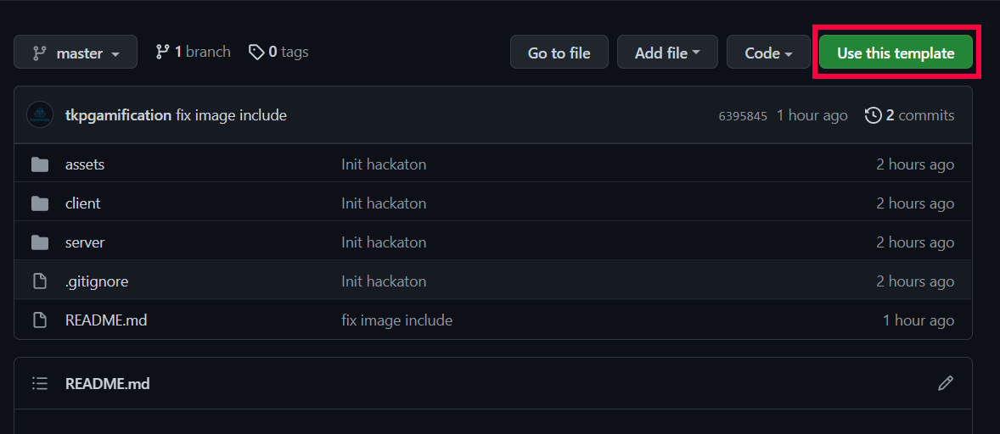
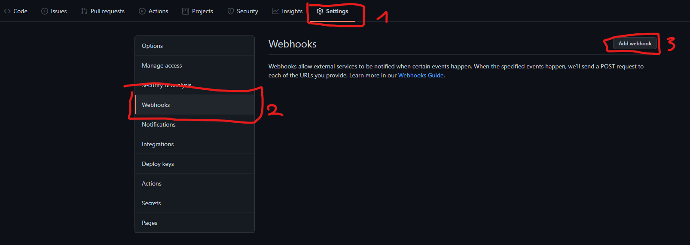
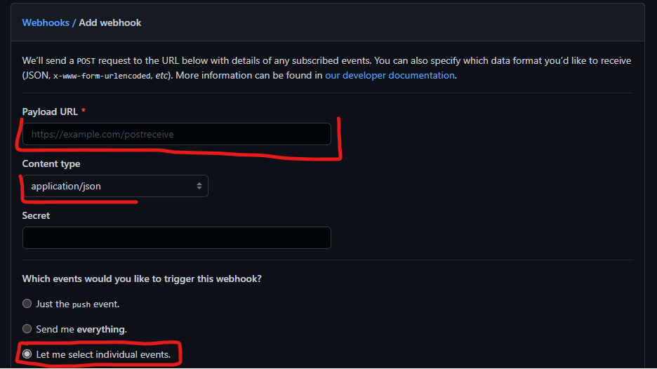
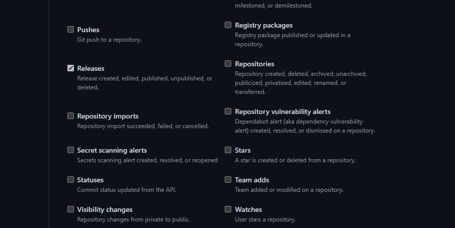
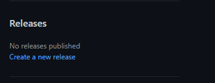
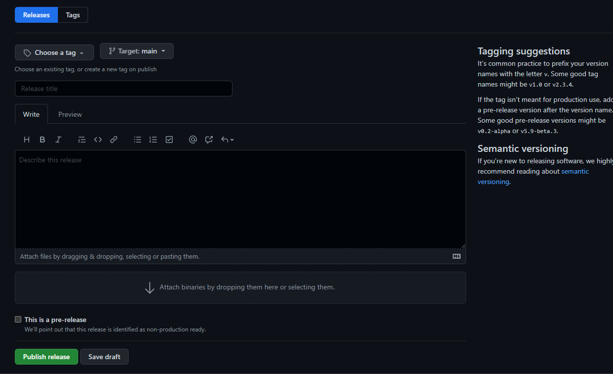

<h1 align="center"><a href="https://thyssenkrupp.crafthub.events/">Engineering in high gear!</a></h1>

<p align="center">
 Thyssenkrupp automotive hackathon<br>
  <a href="#disclaimer">disclaimer</a> •
  <a href="#windows">windows</a> •
  <a href="#linux">linux</a> •
  <a href="#docker">docker</a> •
  <a href="#tips-n-tricks">tips-n-tricks</a>
</p>

What is __*"Engineering in high gear!"*__?

It is Thyssenkrupp's automotive hackathon, the contest is about teams developing a bot which is capable to drive autonomously in a simulated environment provided by the __TORCS__ simulator.

__A detailed technical documentation for the TORCS Simulator can be found__ [__here__](https://arxiv.org/pdf/1304.1672.pdf)

This guide will show you what steps (simulation + server + client) you have to do to be able to execute TORCS Simulations in Windows , Linux and in a containerized environment in wsl or in linux.

Before you start please create your own repository from this template repository to your registered team user. During the creation please make it a private repository and add the **tkpgamification** user.



If you find any issue in the repository please make for it a GitHub Issue.

---
# Disclaimer

For the development we suggest you start with the windows setup, because there is visual feedback for the developed algorithm, but also execute the dockerized solution as well.

__*During the qualification for the 24 hour challenge the evaluation of the released clients by the teams will be validated with the dockerized/docker-compose setup described below*__

---
# Windows

## Server

TORCS Server windows installer: https://sourceforge.net/projects/torcs/files/torcs-win32-bin/1.3.4/

TORCS Server patch for windows: https://sourceforge.net/projects/cig/files/SCR%20Championship/Server%20Windows/2.0/patch.zip/download

Install the game to a path without any special characters (not even spaces are allowed), copy the contents of the patch zip into the game's folder and overwrite the files.


## Client

### Developing the driving algorithm

The algorithm is located in the __CDriver.c__ file. The main function is the __CDrive__ which gets a __structCarState__ and replies with a __structCarControl__.

__You are not allowed to modify any other file.__

You can find detailed information about the sensors and effectors on page 13-14 of the above mentioned official <a href="#simulation">description</a>. There is also the __Cinit__ function which describes 19 angles where the distance sensors shall be located. You can modify this as well to fit your needs.

You have the possibility to specify the type of car you are using in the simulation as follows:

<p align="center"> "repo-name"/client/CAR </p>

Types of cars:

car6-trb1, 155-DTM, kc-p4, car1-stock1, p406

The default type is __car6-trb1__.

Opponents:

To define how many opponents to have with you on the track, set value from 0-9 in the __OPPONENTS__ file.


### Building the client

The easiest way to build the client is to use Visual Studio 2019 Community edition but you can use any preferred IDE to build the software.\
For Visual Studio: create a new empty project, then add all the source files and the WS2_32.lib to the project with the Project->Add Existing Item option. After this you can build and run your client.\
If you get "This function or variable may be unsafe" errors while building, right click on your project, select Properties and add "_CRT_SECURE_NO_WARNINGS" to Configuration Properties->C/C++->Preprocessor->Preprocessor Definitions.

## Simulation

Start the game and navigate to Race->Quick Race->Configure Race. Here, if you choose a racetrack and click accept you should see "scr_server 1" as Selected player. When you finnish configuring the race, you can select "New Race". Now the race will start and it will wait for the client's connection. You have to start your compiled client now(client.exe in your source folder) and it will connect to the server.

You can also run the server in headless mode, you can find detailed information about it in the technical documentation.

---
# Linux
The following description is also valid for wsl based setup on windows host.
## Server

### Building/setup the server
All the example commands for the server build have to be executed from the server folder level

The source of the server can be found here: [TORCS SERVER](https://github.com/fmirus/torcs-1.3.7.git)

### Docker

A docker image of the TORCS Server can be pulled from https://hub.docker.com/r/tkpgamification
```sh
docker pull
```

If you want your self to build the server runtime image the easiest way is to execute the following in wsl or in linux:
```sh
make full-build
```
This target will creates the base image, the build image and the runtime image for the server.

To use with the available docker-compose file change the image tag from **tkpgamification/torcs_server:1.3.7** to **torcs_server:1.3.7**.

## Building the client
All the example commands for the client build have to be executed from the client folder level
To build the client execute the following make target:
```sh
make linux
```
## Docker
To create the docker runtime image for the docker compose based simulation with the containerized torcs server, execute the following make target in wsl or in linux:
```sh
make docker
```

## Simulation guide with docker-compose

After all the required runtime images are made, to start a simulation execute the following in wsl or in linux:
```sh
make simulation RUNTIME_TORCS_CLIENT_IMAGE=<image_name> CAR_NAME=<car_name> ROAD_NAME=<road_name>
```
**RUNTIME_TORCS_CLIENT_IMAGE** is a environment variable to define the docker-compose which client image has to be used during the simulation.
**CAR_NAME** any or that you have set in the CAR file in the client folder
**ROAD_NAME** the name of the selected map you want to execute the game, if you create
To find out what is the name of the client image execute the following in wsl or in linux:
```sh
make show-runtime-client
```
---
# How to publish new client releases

To be able to notify us about new version of the client you have to setup a webhook in github as follow:



Use the webhook url published in discord for the payload url, set content type to application/json and mark let me select individual events



and select the __Releases__ event and set the hook to __Active__ .



After the webhook is set now you can release your new version of the repo.




The webhook link will be provided after all registered teams haw added **tkpgamification** user, on the official channels.

## Please before every release make sure that your solution works locally with the provided dockerized environment setup.
## And the releasing of the solutions can start on **13.10.2021**.
---
# Tips-n-tricks

## Install git for windows

https://git-scm.com/download/win

## Setup wsl
https://docs.microsoft.com/en-us/windows/wsl/install
## Installing docker and docker-compose
The official description of docker installation: https://docs.docker.com/engine/install/ ,

and for docker-compose: https://docs.docker.com/compose/install/
